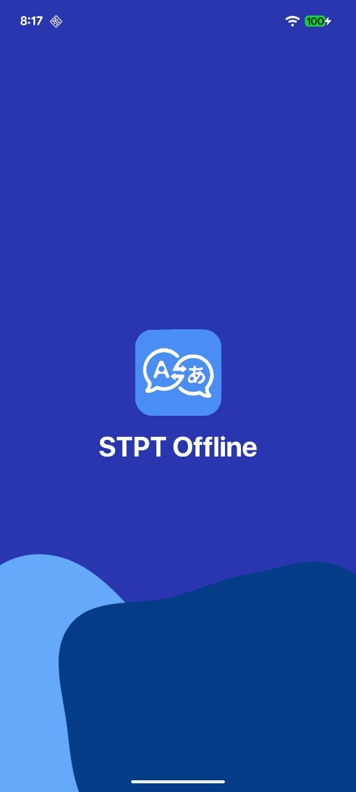
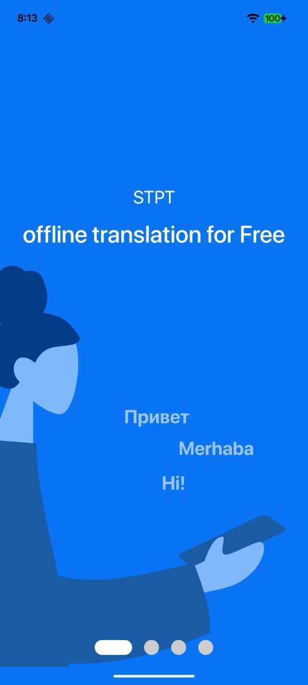
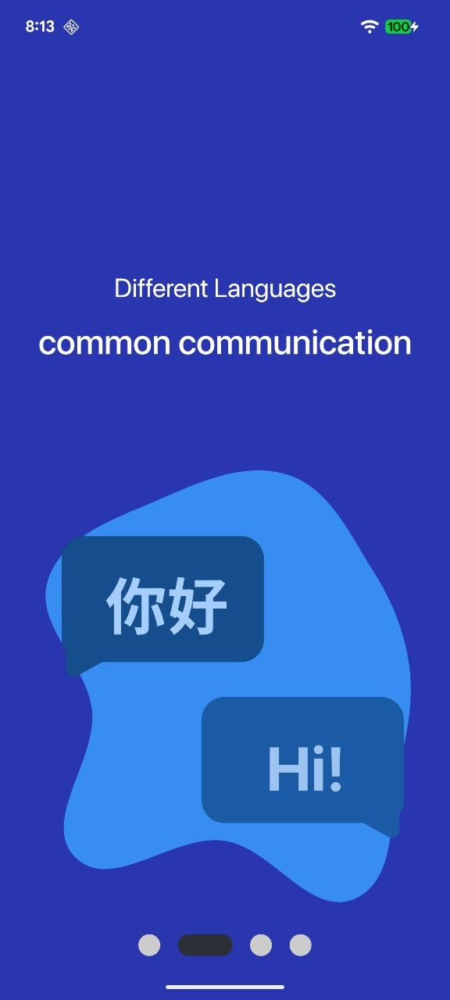
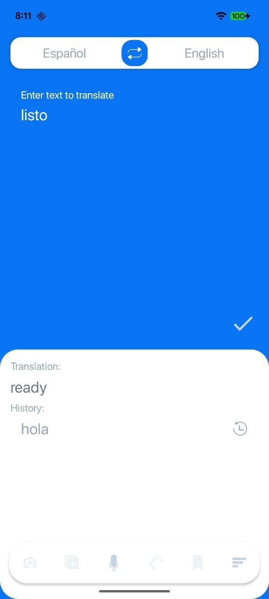
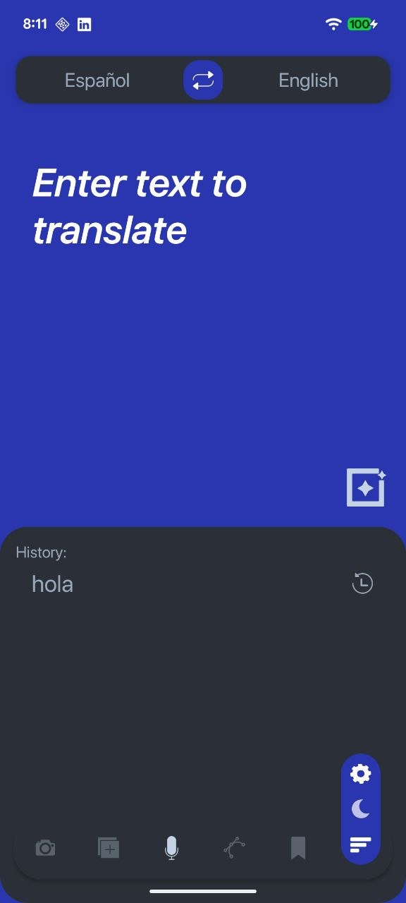
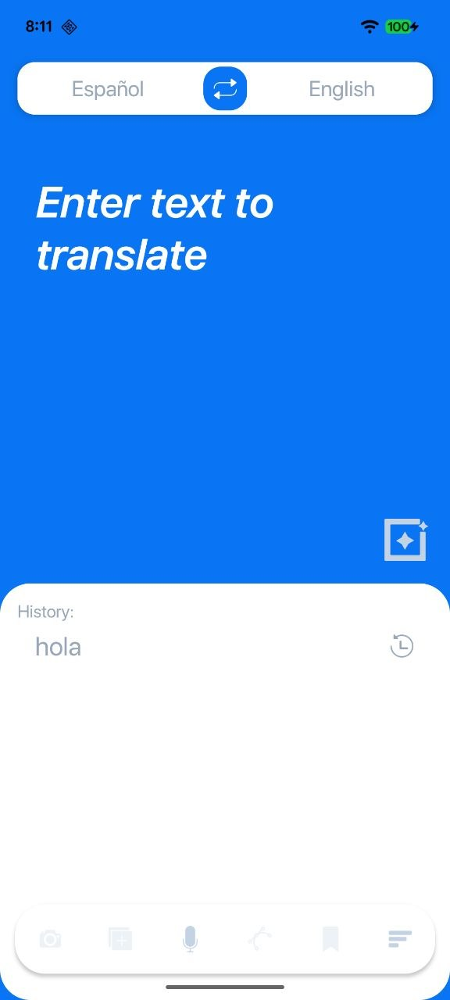
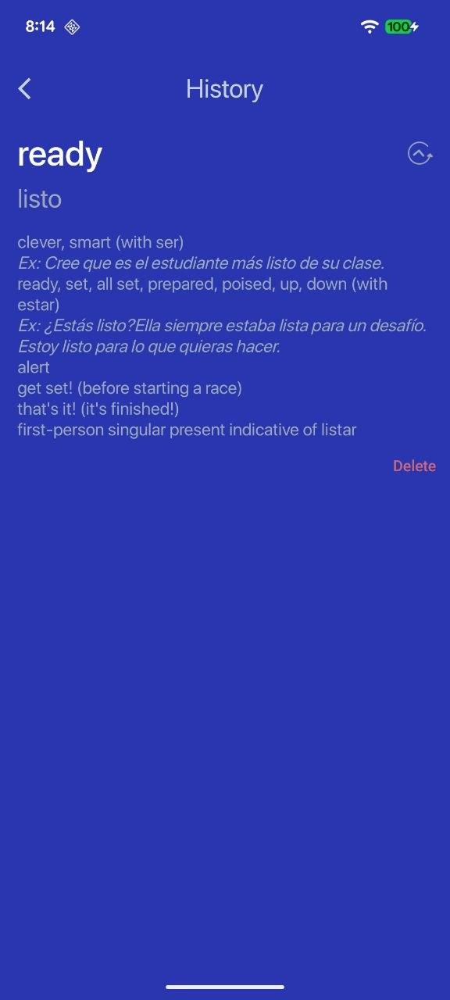
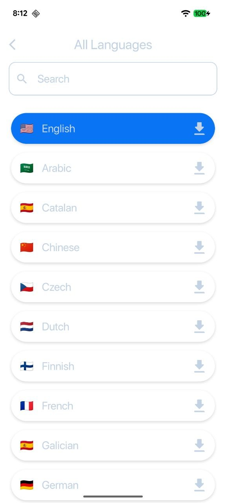
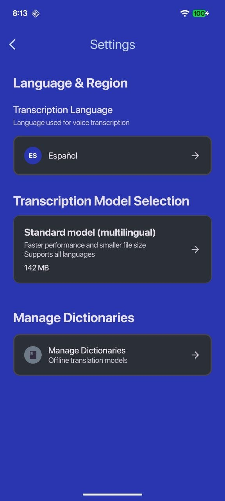
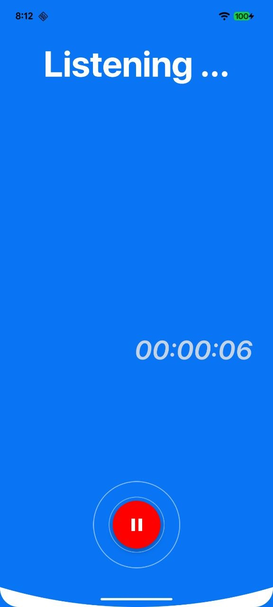

# Speech-to-Speech Translator (KMP) 🎙️➡️🗣️

<p align="center">
  
</p>

[](https://kotlinlang.org)
[](https://www.jetbrains.com/lp/compose-mpp/)
[](https://developer.android.com/studio/releases/gradle-plugin)
[](#)

A high-performance, cross-platform mobile application built with **Kotlin Multiplatform** and **Compose Multiplatform**. The project leverages industry-standard libraries and cutting-edge versions to provide a seamless translation experience.

---

## ✨ Features

- **Real-time Transcription:** Powered by `Whisper.cpp` via Kotlin Native CInterop for high-accuracy, on-device STT.
- **Multilingual Support:** Translation between dozens of languages using Google ML Kit.
- **Dictionary Integration:** Search for word definitions on-the-fly via `Free Dictionary API` with local persistence.
- **True Multiplatform:** Shared UI and logic between Android and iOS using Compose Multiplatform.
- **Modern Architecture:** Clean Architecture principles with MVVM and Dependency Injection (Koin).
- **Offline Capable:** Designed to handle heavy lifting (transcription/translation) on-device where possible.

---

## 📸 Screenshots

<p align="center">
  
  
  
  
</p>
<p align="center">
  
  
  
  
</p>
<p align="center">
  
  
</p>

---

## 🛠 Tech Stack

| Category | Technology |
| --- | --- |
| **Language** | Kotlin 2.4.0 |
| **UI Framework** | Compose Multiplatform 1.11.1 |
| **Dependency Injection** | Koin 4.2.2 |
| **Networking** | Ktor 3.5.0 |
| **Local Database** | Room 2.8.4 (KMP) |
| **Image Loading** | Coil 3.5.0 |
| **Build System** | Gradle 9.6.0 + AGP 9.2.1 |
| **Native Integration** | Whisper.cpp (via CInterop) |

---

## 📂 Project Structure

Following the latest **AGP 9.0+** requirements, the project is modularized to separate application entry points from multiplatform logic:

- `composeApp/`: The Android application module (Entry point).
- `sharedUI/`: A KMP library containing 95% of the codebase (Compose UI, ViewModels, Repositories, and Native Interop).
- `lib/`: Android-specific library for native Whisper bindings.
- `iosApp/`: The Xcode project for the iOS target.

---

## 🚀 Getting Started

### Prerequisites
- Android Studio **Ladybug Feature Drop** or higher.
- Xcode 15.0+ (for iOS development).
- Kotlin Multiplatform Mobile plugin installed.

### Setup
1. Clone the repository:
   ```bash
   git clone https://github.com/your-username/SpeechToSpeechTranslator.git
   ```
2. Open the project in Android Studio.
3. Sync Gradle.
4. For iOS:
   - Navigate to the `iosApp` folder.
   - Run `pod install`.
   - Open `iosApp.xcworkspace` in Xcode.

---

## ✅ Progress & TODO

- [x] **Core Infrastructure:** KMP setup, DI with Koin, and Navigation.
- [x] **Native Interop:** Whisper.cpp integration for Android & iOS.
- [x] **Translation Engine:** ML Kit integration for multilingual support.
- [x] **Networking:** Ktor client integration for external APIs.
- [x] **Persistence:** Room KMP for history and dictionary data.
- [x] **UI/UX:** Material 3 implementation and custom theming.
- [x] **Unit Testing:** General test coverage for repositories and ViewModels.
- [ ] **Translated Text-to-Speech (TTS):** Generate audio from translated text.

---

## Design Credits
This project uses design assets from the Figma Community file:
[Google Translate Redesign](https://www.figma.com/community/file/874980884980495556)  
Created by [Erhan Kbekar](https://www.figma.com/@ekbekar).

## 🤝 Contributing

Contributions are welcome! Please feel free to submit a Pull Request or open an issue for feature requests.

## 📄 License

This project is licensed under the MIT License - see the [LICENSE](LICENSE) file for details.

---
*Developed with ❤️ by fresnohernandez99.*
